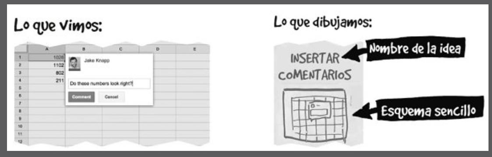
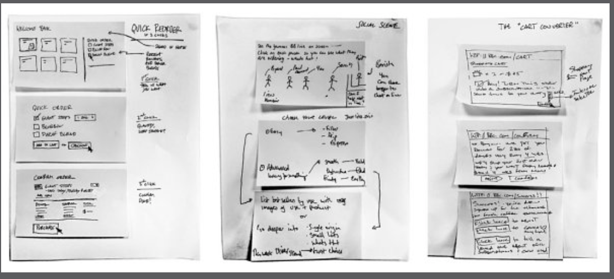
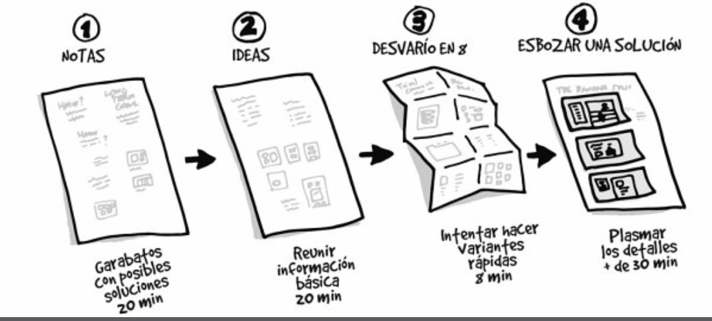
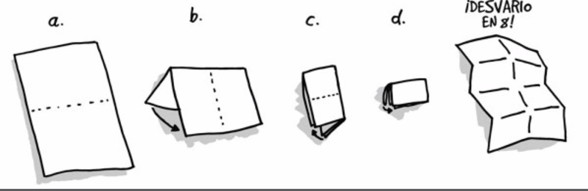
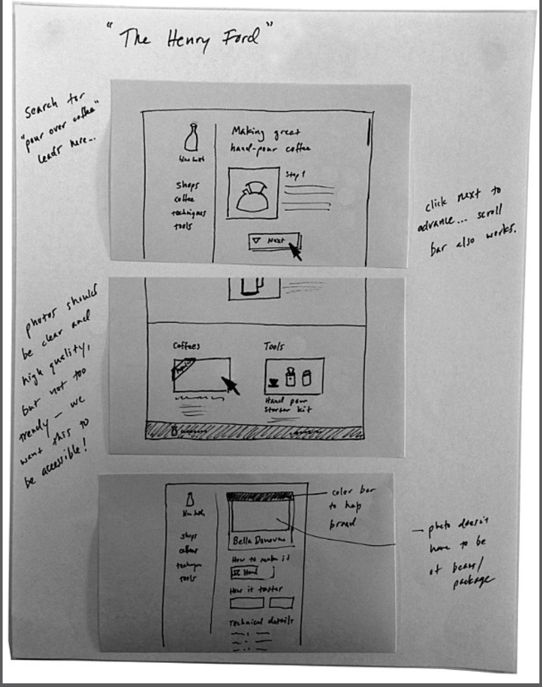
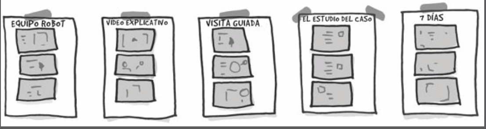
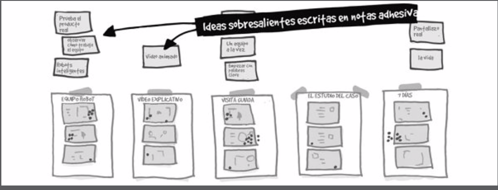
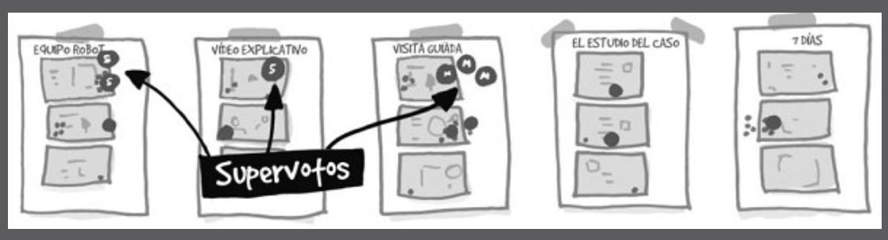

# Lunes

## Metas, preguntas y mapa (1ra parte)

### Establecer la meta a largo plazo
* ¿Por que estamos embarcados en este proyecto?
* ¿Donde queremos estar dentro de un año? ¿De 3? ¿Y de 5?
* La meta debe reflejar los principios y las aspiraciones del equipo
* Una vez fijada la meta a largo plazo debe quedar escrita en la pizarra

### Deben formularse las preguntas que se responderán en el sprint y anotarlas en la pizarra
* Que preguntas queremos responder en el sprint?
* Para conseguir la meta a largo plazo ¿Qué debe ser cierto?
* Si viajáramos al futuro y el proyecto hubiera fracasado, ¿cuál debería ser la causa?
* Se deben transformar las hipótesis y los obstáculos en preguntas
    * P: Para conseguir nuevos clientes: ¿Qué debe ser cierto?
    * R: Deben confiar en nuestra amplia experiencia
    * P: Como podemos convertir eso en una pregunta?
    * R: ¿Confiarían los clientes en nuestra amplia experiencia?


### Construir el mapa
* Debe construirse un boceto, diagrama, mapa o guía. Usar palabras y dibujos sencillos
* Cada mapa está centrado en el cliente. Actores fundamentales a la izquierda
* Pasos para hacer el mapa:
    1. Anotar los actores a la izquierda
    2. Escribir el final (a la derecha)
    3. Palabras y flechas que los unen
    4. Que sea sencillo
    5. Pedir ayuda
* No debería demorar mas de 60 minutos en realizarse (puede seguir actualizandose a lo largo del día)
* El trabajo del lunes consiste en configurar una vision única usando el conocimiento del personal y la experiencia de todos los miembros del equipo

## Preguntar a los expertos (2da parte)
* Charlas individuales con cada uno de los miembros del equipo (los decisores no lo saben todo)

> Estrategia:
El primer interlocutor ha de ser el Decisor. Si él no va a participar en el sprint formando parte del equipo, es importante asegurarse de que asistirá a la reunión del lunes por la tarde. Algunas preguntas útiles que hacerle: «¿Qué necesita este proyecto para triunfar?», «¿Contamos con alguna ventaja u oportunidad única?», «¿Cuál es el mayor riesgo?».”

> Cómo funcionan las cosas:
¿Quién entiende el mecanismo de nuestro producto? En el equipo del sprint contamos con las personas que desarrollan el producto o que muestran la idea: el diseñador, el ingeniero, el experto en ventas…”

Procedimiento

1. Explicar en qué consiste el sprint, en caso de que el experto no forme parte del proyecto
2. Analizar las pizarras: Que el experto lea la meta, las preguntas y el mapa
3. Abrir la puerta: El experto debe contar todo sobre el desafio que tenemos entre manos
4. Preguntar: “¿Es capaz de ver en el mapa algo que esté incompleto? ¿Añadiría alguna pregunta a la lista? ¿Ve alguna oportunidad? Aquí van un par de frases útiles: «¿Por qué?» y «Háblame más de ese tema».”
5. Modificar la pizarra: Se puede modificar en caso de ser necesario

### Tomando notas: ¿Cómo podríamos...?
Cada persona escribe sus propias notas, de una en una, en un taco de notas adhesivas. Al final del dia se recogen todas las notas, se organizan y nos quedamos con las mas interesantes: ¿Cómo podriamos asegurarnos de que el café llegue fresco?

1. Escribimos «CP» en la esquina superior izquierda de la nota adhesiva.
2. Esperamos.
3. Cuando oigamos algo interesante, lo convertimos en una pregunta (en silencio).
4. Escribimos la pregunta en la nota adhesiva.
5. Separamos la nota del taco y la ponemos a un lado.

### Organizando las notas
Cuando los expertos terminan de hablar, se recopilan las notas y pegarlas enla pared (en cualquier orden).

Proximos pasos:

1. Buscar notas de temas similares y agruparlas. (tomar una nota adicional y escribir el titulo del grupo) (10 minutos)
2. Se realiza votación por puntos:
	* Se le entrega a cada miembro del equipo dos pegatinas redondas grandes.
	* Al decisor se le entregan 4 pegatinas (su opinion pesa mas)
	* El equipo debe leer de nuevo las preguntas y el objetivo
	* Todos votan en silencio las preguntas que sean más utiles
	* Se puede votar las propias o votar dos veces la misma.

3. Cuando la votacion llegue a su fin despegamos las preguntas que tengan mas pegtinas y las pegamos en la pizarra del mapa. La mayoria de las preguntas corresponderán a un paso especifico.

### Elegir un objetivo
El decisor necesita elegir un cliente y un acontecimiento del mapa. Elija lo que elija, ambas cosas se convertirán en el objetivo del resto del sprint. Los bocetos, el prototipo y la prueba se desarrollarán a partir de este punto.

1. Pedir al decisor que elija (puede pedir opinion del equipo sin que se forme discusion)
2. Votación silenciosa si el decisor pide opiniones

# Martes

## Demos rápidas (1ra parte)
**Hacer una lista** 

Los miembros del equipo deben hacer una lsta con productos o servicios que puedan examinar en busca de inspiración.  (webs, apps, datos, etc). Todo lo que examinemos debe tener algo bueno de lo que se pueda aprender.

Luego de un rato, todo el mundo debe reducir su lista a los dos productos mas importantes. 

**Demos de 3 minutos**

Cada uno explica en 3 minutos qué tiene de fantástico su recomendación. Puede usarse cualquier herramienta que aporte claridad. (celus, notebooks, etc)

**Anotar las buenas ideas sobre la marcha**

Debe anotarse todo. Primera pregunta: ¿Cuál es la gran idea que puede resultarnos de utilidad? Hacemos un breve boceto rapido, escribimos una breve descripcion y anotamos debajo la fuente.

Esquemas sencillos. Ni complicadas ni muy precisas. Importante ponerles nombre:

Al anotar las ideas en la pizarra, no se debe decidir en el momento cuáles van y cuáles no. Terminamos con entre 10 y 20.

## Esbozar (2da parte)

Haremos bocetos de la solución

#### Bocetos en 4 pasos

**Tomar notas (20 mins)**

El equipo recorre la pizarras y toma notas. Copiar la meta a largo plazo. Anotar todo lo que parezca util. Plantear soluciones alto nivel. Al finalizar, 3 minutos de repaso.

**Ideas (20 mins)**

Esbozar ideas basicas, garabateando, escribiendo titulos, diagramas o monigotes que hacen algo. Hay que dar forma a las ideas.  Al finalizar, 3 minutos de repaso.

**Desvarío en 8 (8 minutos)**

Doblamos una hoja en 8 (doblar 3 veces por su mitad). Un minuto por recuadro. Esbozar ideas distintas. Ayuda para considerar alternativas.

**Esbozar una solución (30 minutos)**

Bajar todas las ideas a papel. Guión gráfico dividido en 3 viñetas.

1. Que sea explicativo. Debe entenderse con solo verlo
2. Mantener el anonimato. Es mas facil criticar y votar.
3. Da igual que sea feo. Tiene que ser detallado, concienzudo y completo.
4. Las palabras importan. Buen uso de palabras. Nada de Lorem Ipsum ni contenido de relleno.
5. Poner titulo atractivo.

Dejamos los bocetos de forma anonima en un montón. 

Fin del día

# Miércoles

## Evaluación de las ideas (1ra parte)

1. Museo del arte: Pegamos los bocetos de las soluciones en la pared con cinta.
2. Mapa térmico: Evaluamos los bocetos en silencio y utilizamos pegatinas para señalar las partes mas interesantes
3. Evaluación veloz: Discutimos brevemente los puntos destacados de cada solución y usamos notas adhesivas para plasmar las mejores ideas.
4. Votación silenciosa. Cada miembro elige una solucion y usa una pegatina redonda para votar.
5. El decisor toma la decisión final con más pegatinas.

### Museo del arte

Se cuelgan los bocetos uno al lado del otro para exponer.

### Mapa térmico

No se explican las ideas. Esto puede sesgar la calidad de la idea (si la persona la presenta bien o se le asocia a X persona)

Se le entregan 20 pegatinas redondas a cada miembro del equipo.

1. No se habla
2. Miramos un boceto
3. Colocamos una pegatina en las partes que nos gusten
4. Ponemos un par de pegatinas en las ideas brillantes
5. Si tenemos una pregunta o algo queda poco claro, la escribimos en una nota adhesiva debajo del boceto
6. Avanzamos hasta el siguiente boceto y repetimos.

No hay reglas ni limites sobre cómo poner las pegatinas. Si alguien quiere mas pegatinas, puede tener mas.

### Evaluación veloz

La conversación será un guión y cronometrado. Alguien debe ser el **escriba**. A medida que se vayan evaluando los bocetos, el escriba anotará las ideas sobresalientes en notas adhesivas.

1. Reunion en torno a un boceto
2. Cronometro en 3 minutos
3. El facilitador narra el boceto (aqui parece que un cliente está pulsando para ver un video, despues pincha un enlace para ir a los detalles...)
4. El facilitador resalta las ideas que tiene mas pegatinas redondas
5. El equipo resalta las ideas sobresalientes que el facilitador se haya pasado
6. El escriba anota las ideas sobresalientes en notas adhesivas y las pega sobre cada boceto. Cada idea debe tener un nombre sencillo como "video animado" o "registro en 1 paso"
7. Revisión de las inquietudes y preguntas
8. El creador del boceto guarda silencio hasta el final (creador, revela tu identidad y dinos que psao por alto)
9. El creador explica cualquier idea que el equipo no haya sido capaz de interpretar y responde todas las preguntas
10. Repetimos con el siguiente boceto

Si, el creador del boceto que se está analizando no habla hasta que el equipo termina. Ahorra tiempo y evita redundancias.

No anotamos nuevas ideas. No debatimos implementaciones futuras. EL objetivo es marcar las ideas sobresalientes

### Votación silenciosa

Conocer la opinion del equipo. No son concluyentes. Ayudan al decisor.

1. Cada miembro del equipo tiene **un voto**. Pegatina redonda color rosa
2. Recordamos la meta a largo plazo y las preguntas
3. Pediremos a los miembros que pequen de imprudentes y hagan mas caso a las ideas arriesgadas con mucho potencial.
4. Cronometramos 10 mins.
5. Cada miembro anota su opcion, puede votar boceto completo o idea de un boceto.
6. Cuando acabe el tiempo, colocamos los votos sobre los bocetos.
7. Cada quien explica brevemente (1 min) por qué votó lo que votó.

### Decisiones sinceras

El decisor debe decidir qué idea se desarrollará. Debe hacerlo segun su parecer sin importar la opinión de la mayoría o el "consenso" del grupo. El decisor tiene la ultima palabra.

### Supervoto

Cada decisor tiene 3 votos especiales (tienen sus iniciales). Lo que vote será la idea a partir de la cual se hará el prototipo.

Pueden elegir las ideas mas populares, ignorar la votación, votar 3 ideas, agrupar sus votos (pueden hacer lo que quieran).

Los bocetos que tengan al menos 1 super voto son los ganadores. Diseñaremos los prototipos siguiendo esas ideas. Los bocetos que no tienen super votos no son ganadores. Los separamos y los agrupamos en ganadores y no ganadores.

A veces los decisores meten la pata y no seleccionan las buenas ideas.

La decision más importante ya está tomada.

¿Qué pasa si hay más de 1 boceto ganador que se contradice con otro?

### Pelea callejera

Se tiene una discusión si se opta por pelea callejera o por solución combinada. La discusion es sencilla, si no lo es, el decisor escoge.

**Pelea callejera**: se desarrollan los 2 productos y se los pone a competir entre si para ver cuál da mejores resultados. Creamos marcas falsas.

Anotar y votar para elegir los nombres:

1. Lapicera y papel para todo el mundo
2. Todos anotan ideas (3 mins)
3. Revisa su lista (2 mins) y reduce a las 2 o 3 mejores
4. Escribir las mejores ideas
5. cada miembro del equipo analiza en silencio todas (2 mins)
6. Se vota en voz alta.
7. El decisor tiene la ultima palabra.

## Guión gráfico (2da parte)

Alguien debe ser **el artista**.

Hacemos una cuadricula en el pizarrón de 15 viñetas. Dibujamos recuadros de un tamaño similar al de un folio.

Primer recuadro, toma de contacto del cliente. ¿Qué debería ser?

### Elegir una escena inicial

¿cómo descubren los clientes la existencia de nuestra empresa? ¿Dónde se encuentran y que hacen antes de usar el producto?

* Busqueda en pagina web
* Revista
* Estantedia de una tienda
* Appstore
* Articulo de prensa
* Noticias de facebook o twitter

Dibujamos la historia viñeta a viñeta, como un comic. El equipo discutirá cada paso a medida que avance.

Usaremos las notas adhesivas de los bocetos ganadores y las pegaremos en la pizarra cada vez que sea posible.

1. Trabajar con lo que tenemos: Resistir el impulso de las cosas nuevas
2. No escribir a la vez. Titulos preliminares y frases importantes. No perfeccionar en grupo. USar frases de los bocetos de la solucion (o dejarlo para el jueves)
3. Incluir todos los detalles posibles cosa que nadie tenga que hacer preguntas.
4. El decisor decide. Tiene la ultima palabra.
5. Ante la duda, arriesgar
6. La historia no debe extenderse más de 15 minutos.

Fin del día.

# Jueves

## Prototipo (1ra parte)

### Escoger las herramientas adecuadas
* Si es una pantalla, keynote, powerpoint o herramienta para crear pagina web.
* Si es papel, keynote, powerpoint, word, etc
* Si es un servicio, escribimos un guion y los miembros del equipo serán los actores
* Si es un espacio fisico, modificaremos un espacio existente
* Si se traba de un objeto, modificaremos un objeto existente, imprimimos protitipo con impresora 3d, creamos el prototipo de la publicidad, etc.

### Dividir y conquistar
El facilitador debera ayudar a repartir los sigueintes trabajos:

* Creador (dos o mas)
* Pegador (uno)
* Redactor(uno)
* Recopilador de fuentes (uno o más)
* Entrevistador (uno)

Los **creadores** se encargan de los componentes individuales (pantallas, paginas, piezas) del prototipo. Son diseñadores o ingenieros, pero puede ser cualquiera que le guste el proceso creativo. 

El **pegador** es el responsable de recoger los componentes de manos de los creadores y unirlos sin que se noten fisuras. Diseñador o ingeniero (puede ser cualquiera). El mejor pegador suele ser muy puntilloso con los detalles. 

El **redactor** debe crear el texto realista necesario para darle sentido al prototipo.

El **Recopilador de fuentes** consigue fotos, iconos, contenido de ejemplo que no se tenga disponible. Paginas web, biblioteca de imagenes, etc.

El **Entrevistador** utilizará el prototipo terminado para la prueba con los clientes. Deberia escribir un guión para la entrevista. Es mejor que no trabaje en la creación de lprototipo. De esta forma no se habrá involucrado emocionalmente en la prueba del viernes y no revelará al cliente su decepción o su alegría.

### Pegarlo todo

El pegador se asegurará que las fechas, la hora, los nombres y demás contenido falso sea coherente en todo el prototipo. Se encarga de que todo esté cohesionado.

### Hacer un ensayo

El pegador repasará todo el prototipo e irá narrando el proceso. Comprobar con el guin gráfico que no se dejó nada afuera. El publico principal del ensayo es el entrevistador que será quien hable con los clientes. Debe familiarizarse con el prototipo y con las preguntas del sprint para sacarle todo el provecho a las entrevistas. 

Buen momento para que aparezca el decisor.

# Viernes

