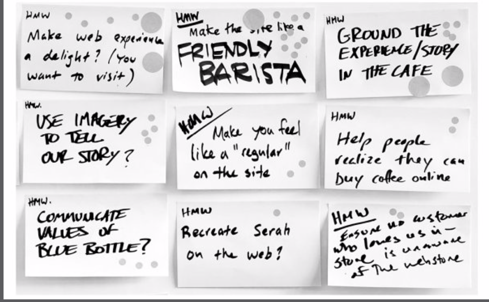

## Dia Lunes

### Establecer la meta a largo plazo
* ¿Por que estamos embarcados en este proyecto?
* ¿Donde queremos estar dentro de un año? ¿De 3? ¿Y de 5?
* La meta debe reflejar los principios y las aspiraciones del equipo
* Una vez fijada la meta a largo plazo debe quedar escrita en la pizarra

### Deben formularse las preguntas que se responderán en el sprint y anotarlas en la pizarra
* Que preguntas queremos responder en el sprint?
* Para conseguir la meta a largo plazo ¿Qué debe ser cierto?
* Si viajáramos al futuro y el proyecto hubiera fracasado, ¿cuál debería ser la causa?
* Se deben transformar las hipótesis y los obstáculos en preguntas
    * P: Para conseguir nuevos clientes: ¿Qué debe ser cierto?
    * R: Deben confiar en nuestra amplia experiencia
    * P: Como podemos convertir eso en una pregunta?
    * R: ¿Confiarían los clientes en nuestra amplia experiencia?


### Construir el mapa
* Debe construirse un boceto, diagrama, mapa o guía. Usar palabras y dibujos sencillos
* Cada mapa está centrado en el cliente. Actores fundamentales a la izquierda
* Pasos para hacer el mapa:
    1. Anotar los actores a la izquierda
    2. Escribir el final (a la derecha)
    3. Palabras y flechas que los unen
    4. Que sea sencillo
    5. Pedir ayuda
* No debería demorar mas de 60 minutos en realizarse (puede seguir actualizandose a lo largo del día)
* El trabajo del lunes consiste en configurar una vision única usando el conocimiento del personal y la experiencia de todos los miembros del equipo

### Preguntar a los expertos
* Charlas individuales con cada uno de los miembros del equipo (los decisores no lo saben todo)

> Estrategia:
El primer interlocutor ha de ser el Decisor. Si él no va a participar en el sprint formando parte del equipo, es importante asegurarse de que asistirá a la reunión del lunes por la tarde. Algunas preguntas útiles que hacerle: «¿Qué necesita este proyecto para triunfar?», «¿Contamos con alguna ventaja u oportunidad única?», «¿Cuál es el mayor riesgo?».”

> Cómo funcionan las cosas:
¿Quién entiende el mecanismo de nuestro producto? En el equipo del sprint contamos con las personas que desarrollan el producto o que muestran la idea: el diseñador, el ingeniero, el experto en ventas…”

Procedimiento

1. Explicar en qué consiste el sprint, en caso de que el experto no forme parte del proyecto
2. Analizar las pizarras: Que el experto lea la meta, las preguntas y el mapa
3. Abrir la puerta: El experto debe contar todo sobre el desafio que tenemos entre manos
4. Preguntar: “¿Es capaz de ver en el mapa algo que esté incompleto? ¿Añadiría alguna pregunta a la lista? ¿Ve alguna oportunidad? Aquí van un par de frases útiles: «¿Por qué?» y «Háblame más de ese tema».”
5. Modificar la pizarra: Se puede modificar en caso de ser necesario

### Tomando notas: ¿Cómo podríamos...?
Cada persona escribe sus propias notas, de una en una, en un taco de notas adhesivas. Al final del dia se recogen todas las notas, se organizan y nos quedamos con las mas interesantes: ¿Cómo podriamos asegurarnos de que el café llegue fresco?

1. Escribimos «CP» en la esquina superior izquierda de la nota adhesiva.
2. Esperamos.
3. Cuando oigamos algo interesante, lo convertimos en una pregunta (en silencio).
4. Escribimos la pregunta en la nota adhesiva.
5. Separamos la nota del taco y la ponemos a un lado.

